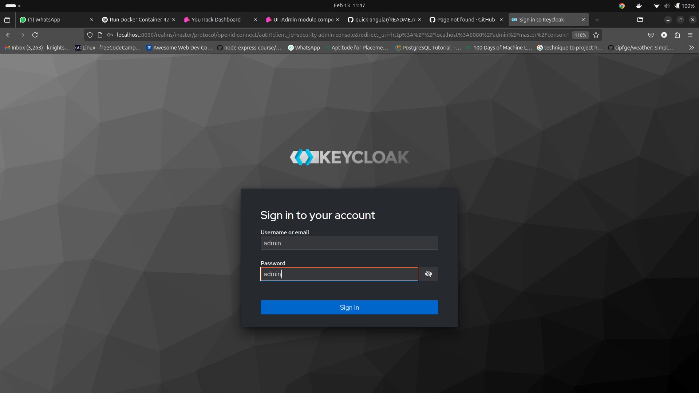
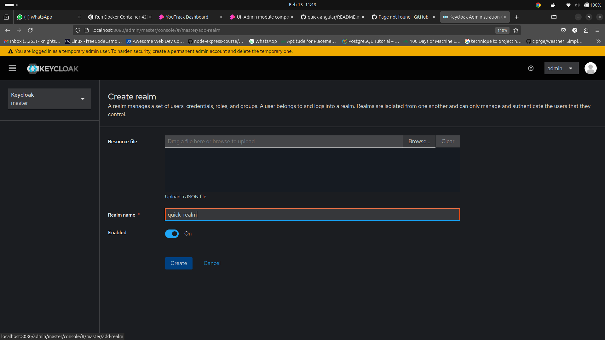
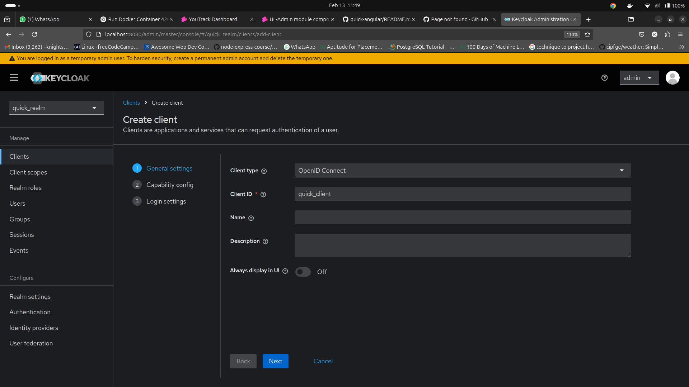
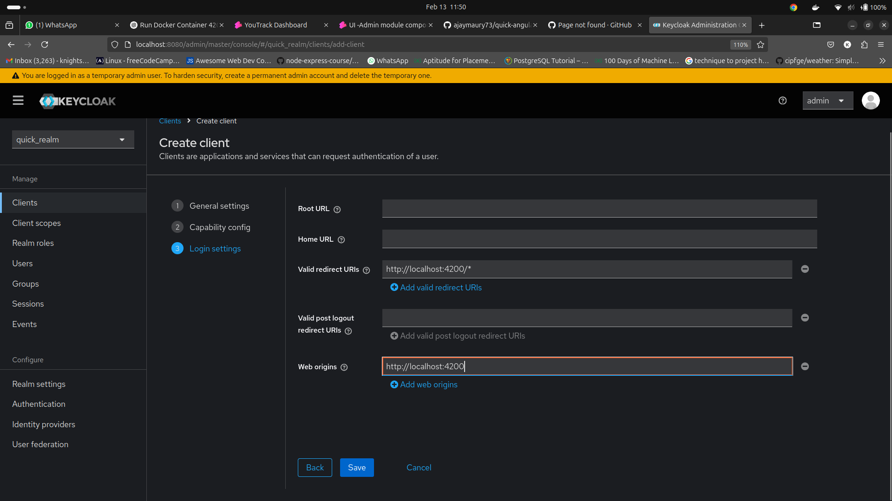
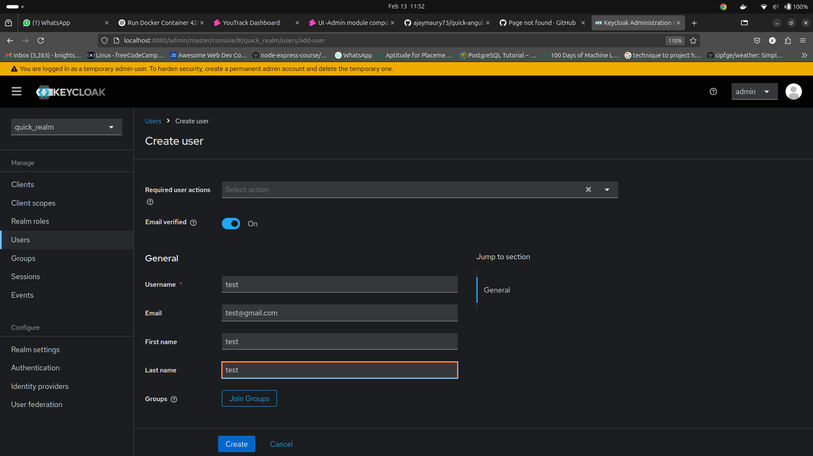
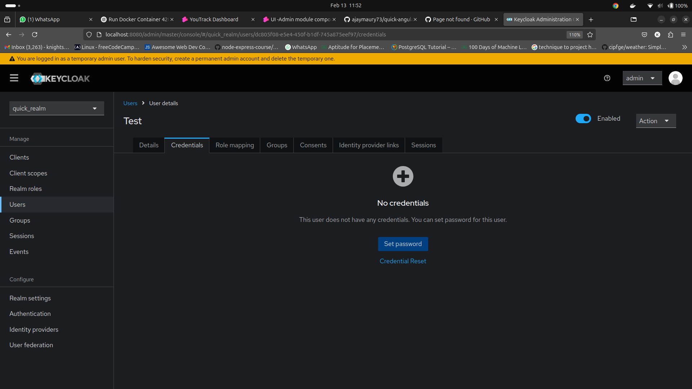
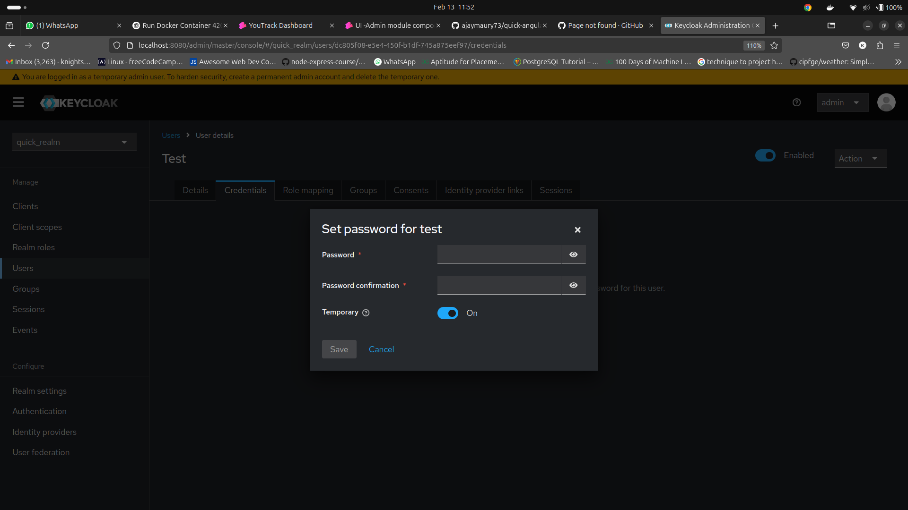

# **Angular Microfrontend Setup with Native Federation**

This guide walks through setting up a **microfrontend (MFE) architecture** using **Angular Native Federation**.

## **Prerequisites**
- Node.js (v18+ recommended)
- Angular CLI (v18+)
- Git (for version control)

### **1️⃣ Create a New Angular Workspace**
```sh
mkdir angular-mf
cd angular-mf
ng new native --create-application=false
cd native
```
This creates a new **Angular workspace** without an initial application.

---

### **2️⃣ Generate Microfrontend Applications**
Create two microfrontend applications (`mfe1` and `mfe2`):

```sh
ng generate application mfe1 --routing --style=scss
ng generate application mfe2 --routing --style=scss
```
- `--routing`: Enables Angular routing.
- `--style=scss`: Uses SCSS for styling.

---

### **3️⃣ Install Native Federation for MFEs**
Run the following commands to configure **Native Federation** for each microfrontend:

```sh
ng add @angular-architects/native-federation@18.2.7 --project mfe1 --type remote --port 4201
ng add @angular-architects/native-federation@18.2.7 --project mfe2 --type remote --port 4202
```
- `--type remote`: Marks the project as a **remote module**.
- `--port 4201` / `--port 4202`: Assigns a development port for each microfrontend.

---

### **4️⃣ Generate Shell (Host) Application**
```sh
ng generate application shell --routing --style=scss
```
This will be the **host application** that loads the remote MFEs dynamically.

---

### **5️⃣ Install Native Federation for Shell**
```sh
ng add @angular-architects/native-federation@18.2.7 --project shell --type dynamic-host --port 4200
```
- `--type dynamic-host`: Configures the shell as a **dynamic host**.
- `--port 4200`: Assigns the port for the shell.

---

### **6️⃣ Run Applications**
Run each MFE and the shell separately:

```sh
# Start MFE 1
ng serve mfe1

# Start MFE 2
ng serve mfe2

# Start Shell
ng serve shell
```

Now, the **Shell (host)** at `http://localhost:4200/` can load `mfe1` and `mfe2` dynamically.

### Step 4: Configure Keycloak

After running Keycloak, access it via [http://localhost:8080](http://localhost:8080) using the admin credentials (`admin` as both username and password).




#### 4.1 Create a New Realm

1. **Log in to Keycloak** at [http://localhost:8080](http://localhost:8080) using the credentials `admin/admin`.
2. Go to the **Master** realm and click on **Add realm**.
3. Enter the name of the new realm as `quick_realm` and save.



#### 4.2 Create a New Client

1. Under the `quick_realm`, click on **Clients** in the left sidebar and then **Create**.
2. Enter the client ID as `quick_client`.
3. Set the **Client Protocol** to `openid-connect` and save.




#### 4.3 Configure Redirect URL and Web Origins

1. In the `quick_client` settings, scroll to the **Valid Redirect URIs** field and enter:
   
   ```plaintext
   http://localhost:4200/*
   ```

2. Under **Web Origins**, enter:
   
   ```plaintext
   http://localhost:4200
   ```



#### 4.4 Set Client Credentials

1. In the `Credentials` tab, set the **Username** and **Password** of your choice.
   
   - Username: `your_username`
   - Password: `your_password`








